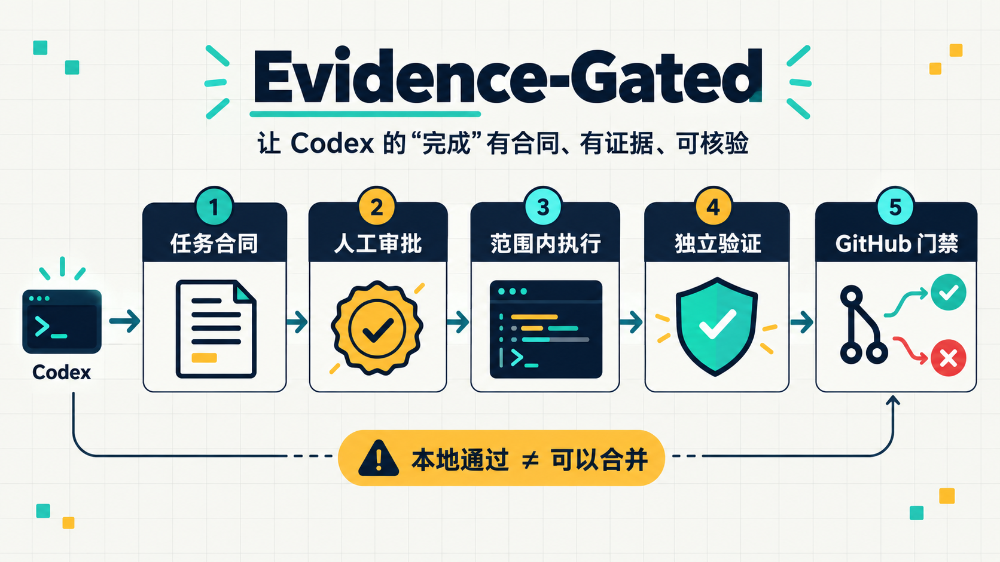

# Evidence-Gated for Codex

<p align="center">
  
</p>

> 让 Codex 的“完成”有合同、有证据、可核验。

[](https://developers.openai.com/plugins/build/plugins)
[](https://github.com/2023Anita/evidence-gated/actions/workflows/ci.yml)
[](LICENSE)
[](https://www.python.org/)

Evidence-Gated 是一个 **Codex 专用工程治理插件**。它把普通的 Skill 工作流升级成一条可检查的链：先写清任务合同，由人确认范围，再执行代码，随后由固定验证器重新检查，最后交给 GitHub 的审查和 Required Check 决定是否可以合并。

当前版本是一个可运行的 `0.1.0` MVP，专门用一个小而真实的 Python 输入校验任务证明这条链能工作。它没有把“本地测试通过”包装成“线上门禁已完成”。

## 先用一句话理解

普通提示词会说：**请记得测试。**

Evidence-Gated 会记录：**测试哪个版本、由哪个验证器检查、哪些检查通过、审批是否仍然匹配，并在证据缺失时拒绝继续。**

## 它解决什么问题

| 常见问题 | Evidence-Gated 的处理方式 |
|---|---|
| Agent 自己说“已经完成” | 固定验证器重新运行检查并生成机器可读报告 |
| 开发中偷偷扩大修改范围 | 合同列出允许路径；越界修改直接失败 |
| 改完代码继续使用旧测试报告 | 报告绑定合同、治理版本和代码摘要 |
| Agent 把自己写成“人工已批准” | 审批使用外部 SSH 签名，默认没有批准者 |
| 本地绿色就直接合并 | GitHub 审查和 Required Check 是最终合并条件 |
| 修改验证脚本让结果永远通过 | CI 模板从固定治理提交读取验证代码 |

## 五分钟体验

要求：macOS 或 Linux、Python 3.12+、OpenSSH。运行时只使用 Python 标准库。

```bash
git clone https://github.com/2023Anita/evidence-gated.git
cd evidence-gated
python3 -I scripts/demo.py
```

你会看到一次完整演示：

1. 示例代码故意把 `bool` 当作整数接受。
2. 固定验收器发现错误并返回退出码 `12`。
3. 示例恢复正确实现。
4. 6 项独立验收测试和 4 项项目测试全部通过。

演示使用临时测试身份和本地主机进程。它不会读取你的私钥、登录 GitHub、提交代码或批准真实项目。

预期摘要：

```json
{
  "demo": "PASS",
  "before_exit": 12,
  "after_verdict": "PASS",
  "simulated_approval": true
}
```

## 安装到 Codex

Codex CLI 需支持插件命令。安装公开仓库：

```bash
codex plugin marketplace add 2023Anita/evidence-gated
codex plugin add evidence-gated@evidence-gated
```

安装后打开一个新的 Codex 任务，让 Skill 索引刷新。你会看到五个入口：

| Skill | 用途 |
|---|---|
| `@evidence-gated:egw-spec` | 建立任务合同与规格 |
| `@evidence-gated:egw-plan` | 生成可审查实施计划 |
| `@evidence-gated:egw-build` | 在批准范围内实施 |
| `@evidence-gated:egw-verify` | 重跑验证并解释证据 |
| `@evidence-gated:egw-ship` | 检查交付和合并条件 |

本仓库只提供 Codex 适配；没有 Claude Code 命令或 Hooks。

## 最小使用流程

安装 Skill 后，可以直接告诉 Codex：

```text
使用 @evidence-gated:egw-spec，为这个低风险 Python 任务建立合同：
校验重试次数，0 和正整数有效，负数报 ValueError，布尔、字符串和浮点数报 TypeError。
```

也可以直接调用 CLI：

```bash
PLUGIN_ROOT="/你的/evidence-gated/路径"
PROJECT="/你的/业务项目路径"

python3 "$PLUGIN_ROOT/scripts/egw.py" init \
  --root "$PROJECT" \
  --task TASK-001 \
  --objective "校验重试次数的输入边界"

python3 "$PLUGIN_ROOT/scripts/egw.py" spec --root "$PROJECT"
python3 "$PLUGIN_ROOT/scripts/egw.py" status --root "$PROJECT" --json
```

此时会生成：

```text
task-contract.json
tasks/TASK-001/
├── spec.md
├── plan.md
├── baseline.json
└── approval-request.json
```

接下来由独立批准者审查并签署 `approval-request.json`。缺少有效签名时，执行门禁返回 `13`；这正是默认保护行为。

```bash
python3 "$PLUGIN_ROOT/scripts/egw.py" gate \
  --root "$PROJECT" \
  --checkpoint execute

python3 "$PLUGIN_ROOT/scripts/egw.py" verify --root "$PROJECT"
```

默认验证要求 Docker，并使用无网络、只读挂载、非 root、固定镜像摘要的执行环境。`--local` 只适合用户明确允许的可信代码预检查，不能当成 CI 通过。

完整审批说明见 [docs/approvals.md](docs/approvals.md)，GitHub 门禁接入见 [docs/ci-setup.md](docs/ci-setup.md)。

## 架构

<p align="center">
  
</p>

真正的强制力来自三部分共同工作：

1. 受保护的治理代码和批准者公钥。
2. 独立验证器在可信环境重跑检查。
3. GitHub 分支规则把证据检查设为 Required Check。

Skills、`AGENTS.md` 和本地状态负责协作与引导，但不能单独构成防绕过门禁。详细解释见 [架构与设计](docs/architecture.md) 和 [威胁模型](docs/threat-model.md)。

## 任务怎样流转

<p align="center">
  
</p>

五个 CLI 命令保持刻意精简：

| 命令 | 做什么 | 不做什么 |
|---|---|---|
| `init` | 创建合同、规格、计划和基线 | 不覆盖已有任务 |
| `spec` | 严格校验并生成待签名摘要 | 不替人批准 |
| `gate` | 检查执行、审查或合并条件 | 不提交、不合并 |
| `verify` | 重跑固定检查并写证据报告 | 不接受合同传入任意 Shell |
| `status` | 展示本地进度和缺少的条件 | 不把本地状态冒充平台事实 |

## 当前 MVP 的准确范围

`0.1.0` 只实现一个固定 profile：`software-python-retry`。

- 允许修改 `src/retry_config.py` 和 `tests/test_retry_config.py`。
- 验证整数、负数、布尔、字符串和浮点数边界。
- 拒绝未知验证器、任意命令、越界文件和治理层修改。
- 把候选代码复制到最小临时执行树，不携带 `.git`、环境文件或其他项目内容。

它目前不是通用多语言 Agent 平台，也没有实现医学／科研证据审核。扩展新 profile 时，应由治理维护者增加明确 Schema、策略和固定验证器，而不是把允许路径改成 `**`。

## GitHub 硬门禁

仓库提供 [业务项目 Workflow 模板](templates/github/evidence-gate.yml)，但把 YAML 复制进项目并不会自动获得硬门禁。维护者还需要：

1. 把治理版本固定到完整提交 SHA。
2. 保护 Workflow、批准者公钥和治理仓库。
3. 启用 Required Check 和当前版本人工审查。
4. 确保 Agent 身份不在 bypass 列表中。
5. 用一个故意失败的 PR 验证平台确实阻止合并。

在完成这些步骤以前，应把系统描述为“本地治理试点”。

## 已验证

- 54 项本地自动化测试通过。
- 错误实现被固定验收器拦截，修复后 10 项测试通过。
- 5 个 Codex Skills 和插件元数据通过静态校验。
- 39 个上游文件的 SHA256 与 Git blob SHA 可复算。
- 合同、审批和报告 Schema 通过验证。
- CI YAML 可解析；GitHub API 场景使用 mock 覆盖。

当前开发机没有 Docker，因此容器实际运行尚未验证；GitHub Required Check 和真实 PR 也尚未在线验收。详见 [本地验收记录](docs/validation.md)。

## 项目结构

```text
evidence-gated/
├── .codex-plugin/          # Codex 插件元数据
├── .agents/plugins/        # Codex marketplace 入口
├── skills/                 # 五个 Codex 工作流
├── workflow/               # 合同、状态、策略、签名和证据引擎
├── verifiers/              # 固定独立验证器
├── templates/github/       # 业务仓库 CI 门禁模板
├── examples/               # 最小真实案例
├── tests/                  # 正常流程和绕过测试
├── assets/                 # 首页说明图、架构图和流程图
├── upstream/               # 固定的 agent-skills 上游快照
└── docs/                   # 审批、架构、CI、安全和验收文档
```

## 上游与许可证

本项目基于 [addyosmani/agent-skills](https://github.com/addyosmani/agent-skills) 的工作流思想和固定核心快照扩展，基线提交为 `be4e44a9fbc5e8df0beaefadbb28bd22ee61cc39`。上游原始版权与 MIT 许可证保留在 `upstream/agent-skills/`；新增代码同样采用 MIT。

来源、文件哈希和升级边界见 [UPSTREAM.md](UPSTREAM.md)。

## 参与贡献

欢迎从以下小目标开始：

- 补充一个明确、可独立验证的低风险 profile。
- 增加绕过场景或跨平台测试。
- 改进中文文档、安装体验和错误提示。
- 在真实受保护仓库完成 Docker／GitHub 门禁复现。

请先阅读 [CONTRIBUTING.md](CONTRIBUTING.md) 和 [SECURITY.md](SECURITY.md)。安全问题不要公开提交利用细节。
