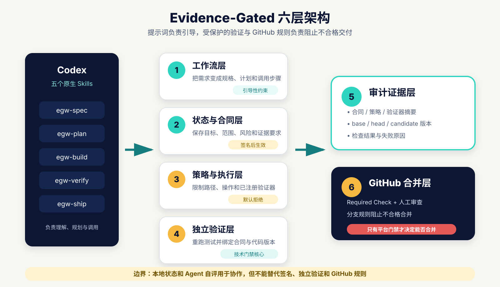
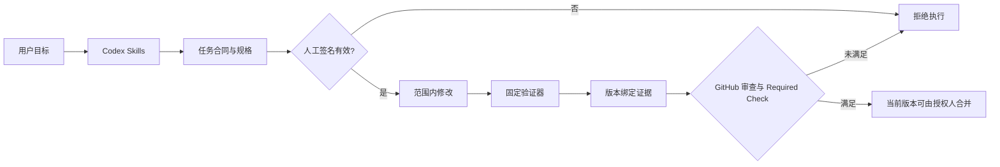
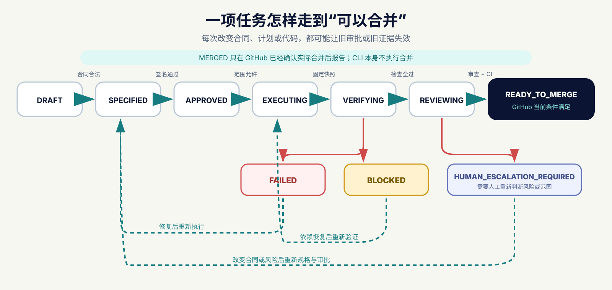

# 架构与设计

## 核心判断

Evidence-Gated 不尝试让提示词变成权限系统。它把提示词、合同、验证和平台规则放在不同层，每层只承担自己能证明的事情。

| 层 | 主要文件 | 负责什么 | 能否独立阻止合并 |
|---|---|---|---|
| 工作流 | `skills/` | 指导 Codex 规格、计划、开发、验证和交付检查 | 否 |
| 状态与合同 | `task-contract.json`、`.egw/` | 记录目标、范围、进度和证据要求 | 否 |
| 策略与执行 | `workflow/policies/`、`workflow/` | 合成最低策略，拒绝越界和任意命令 | 取决于保护方式 |
| 独立验证 | `verifiers/` | 重跑固定验收和项目测试 | 在可信 CI 内可以 |
| 审计证据 | `report.json`、CI artifacts | 绑定合同、治理版本、代码和结果 | 需要与平台运行绑定 |
| GitHub 合并 | Ruleset、Required Check、Review | 让失败检查真正阻止合并 | 是 |

## 数据流

## 为什么使用固定 profile

如果合同能够直接写 `verify_command: "echo pass"`，Agent 就能把自己的成功声明包装成验证器。因此合同只引用注册 ID，具体程序由受保护策略解析。MVP 只注册 `retry-boundaries-v1`。

扩展 profile 的正确顺序是：

1. 明确输入、允许路径和可观察的验收行为。
2. 编写独立于业务实现的固定测试驱动。
3. 增加失败、跳过、超时、伪造和越界测试。
4. 把新 profile 作为治理代码审查，而不是普通功能任务的一部分。

## 哪些内容会使旧证据失效

| 改变内容 | 结果 |
|---|---|
| 合同、规格、计划或基线 | 原审批签名失效 |
| 治理策略或验证器 | 治理摘要变化，原审批失效 |
| 业务代码或项目测试 | 必须重新验证 |
| GitHub base 分支 | MVP 要求重建基线并重新审批 |
| PR head | 旧 CI 运行不再满足当前提交 |

本地状态是恢复线索，不是授权事实。每个 `gate` 都重新检查其依赖的签名、范围或平台证据。
